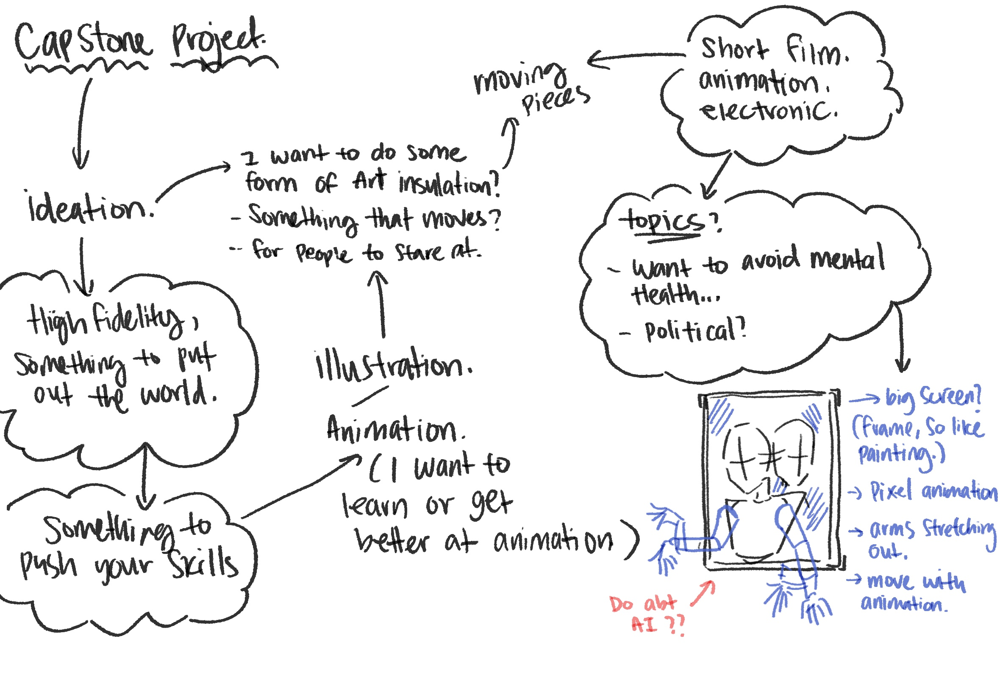
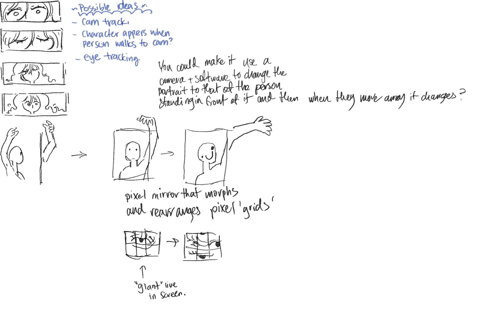

# Week 01

[← Back to Home](../index.md)

## Week 1

This week, we focused on demo focus. something that could be useful for capstone.

 

It needed to be something within my skill set. something Im already good with. it needs to be high fidelity so is able to be put out into the world. 

I wanted to do an installation piece, I imagined a screen with a frame, and it would display the animation. I also think it would be cool to have arms coming out of the screen 

I also asked help from my peers regarding my idea, and I got some really solid feedback. which I will take into consideration for my project. 

Regarding the topic of my capstone project. I wanted to avoid doing mental health? just because I think it's too hard to work with. especially with research and user testing. (as I did with the past assignment 231) 

Livi came in and spoke about her past capstone project. she mentioned that we should be able to push our skills- to learn something while making the project. so i want to take this time into learning animation. 