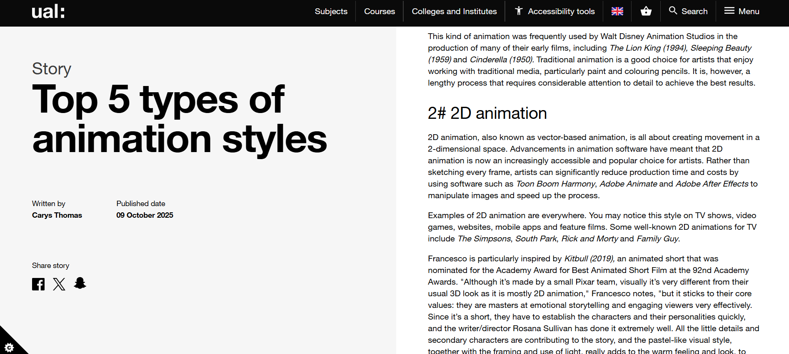
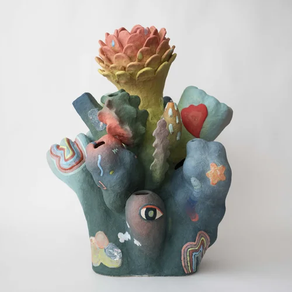

# Week 02

[← Back to Home](../index.md)

## Documentation 
For this week, we mainly focused on tech demo, discussing in my group I don't really have a topic I wanted to do. But I knew I wanted to take this time to learn or better something I'm not already good at. So this could mean choosing between 3D modeling, Animation and something hands on (crafts?)

So taking from last weeks guest speaker, I landed on doing Animation for my tech demo. 

I chose to do animation because I already have some past work I've done. 

**Things to include in my demo**

- Types of animation
- how is this relevant to design?
- Intro?
- real life examples
- tips
- key steps
- conclusion

I wanted to focus mainly on 2D animation, But will cover the five main animation types- some research
Since I only have 10-15 min of the demo, I think I will just showcase what I have and go through it in detail instead of having my peers do it on their own devices. Also introduce some of the applications that are available for animation

I planned my slides based on the examples that are on canvas.

**How I feel?**

I'm a bit stressed about this because I don't exactly know where to start with my presentation. But following the tech demo slides that were given to me really helped. although I am terrified of presenting towards my peers. some of them seems really harsh and personally I don't think I take criticism well (#mightcry)

**what have I learnt this week?**

I have broadened my understanding of animation, whether if it's different types or just some general tricks and tips to help with having a smoother animation. (so having key frames, frame rates, line weight etc) and the 12 principles of animation.

**Evaluation**

Surprisingly, everything went really well while doing my presentation, and I think I've written all there is needed. I'm really proud of how I differentiated the types of animations. and then going into depth.

**What influenced me to do this tech demo?**

I landed on doing animation because It's something that I'm passionate about, I don't have a lot of experience but I want to use this opportunity to better my understanding and skills in the topic, while presenting to my peers. I do realize however I am going in doing this presentation for those who already have a basic knowledge in animation, which might be a problem(?) I am keeping this in mind and changing some things as we go so it's as beginner friendly as possible.

**Conclusion**

While going through the last stretch of things, I went and added some images. Although I am nervous, I think the best thing for me is to stay calm. I tend to overtalk when I'm anxious. So lets hope that doesn't happen.

Out of the things I learnt while researching this topic, I feel like I would learn better with more hands on stuff, so actually taking out the time to practice and better refine what I already have (just not now because I have a lot of assignments..)

**Action Plan + next week**

Goals for next week is to make out the presentations alive, get the peer reviews and reflect on them. I think I did pretty okay for this tech demo, but I'm sure there are plenty of things I need to work on. So in a twisted way I am looking forward into the feedbacks I get.

Based on these two weeks so far, I see that I still haven't gotten use to the rhythm of uni. (more like dropped out of rhythm actually) I found myself lazing around and procrastinating. I do feel like my presentation could have a bit more if I just planned the timing better. Which for similar projects I will take in consideration with much more careful planning.

## Group Digest

Also looked into something for my group digest, I found this ceramic artist and her work is very interesting to me.

**Why I chose this?**

Her topic for this exhibition focuses on questions like how do we conceive of change? With fear, excitement, or uncertainty? While building sculptural ceramics of speculative beings and imagined landscapes, she treats utopia not as an ideal end state, but as a way of testing how material, structure and organic reference can generate new, more hopeful possibilities for how forms and systems might evolve.

**The relevance**

Design can be a tool for speculation and storytelling, by creating forms like this. She invites viewers to become active participants in constructing meaning. This approach is highly relevant for designers looking to create work that is not just functional but also something that emotionally connects to the user. 

## Reference
Group digest research:

https://joymachine.art/blogs/news/janny-baek-life-forms 

https://www.jannybaek.com/ceramics
https://www.designboom.com/art/janny-baek-sculpture-ecosystem-colorful-ceramic-organisms-life-forms-joy-machine/

Tech demo research:
-https://www.iiad.edu.in/the-circle/reel-to-real-short-form-animation-design/ 

https://www.123internet.agency/the-role-of-animation-in-modern-graphic-design-elevating-visual-storytelling/

https://www.arts.ac.uk/study-at-ual/short-courses/stories/top-5-types-of-animation-styles 

https://medium.com/design-bootcamp/the-role-of-animation-in-enhancing-user-experience-cfa11fa9efb4

https://educationalvoice.co.uk/2d-animation-techniques/

https://prolificstudio.co/blog/key-elements-of-2d-animation/

https://animationclub.school/blog/how-to-start-animating-2d-animation-basics-for-beginners/

https://www.clipstudio.net/how-to-draw/archives/172581

https://www.red-dot.org/zh/magazine/film-and-animation-designing-moving-images

https://www.svgator.com/blog/what-is-2d-animation/#:~:text=A%20more%20advanced%20form%20of%20cut%2Dout%20animation%2C,over%20character%20movement%20without%20redrawing%20each%20frame.