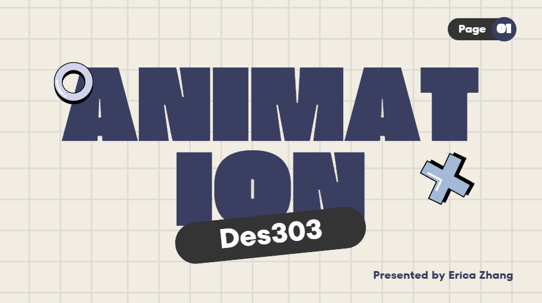
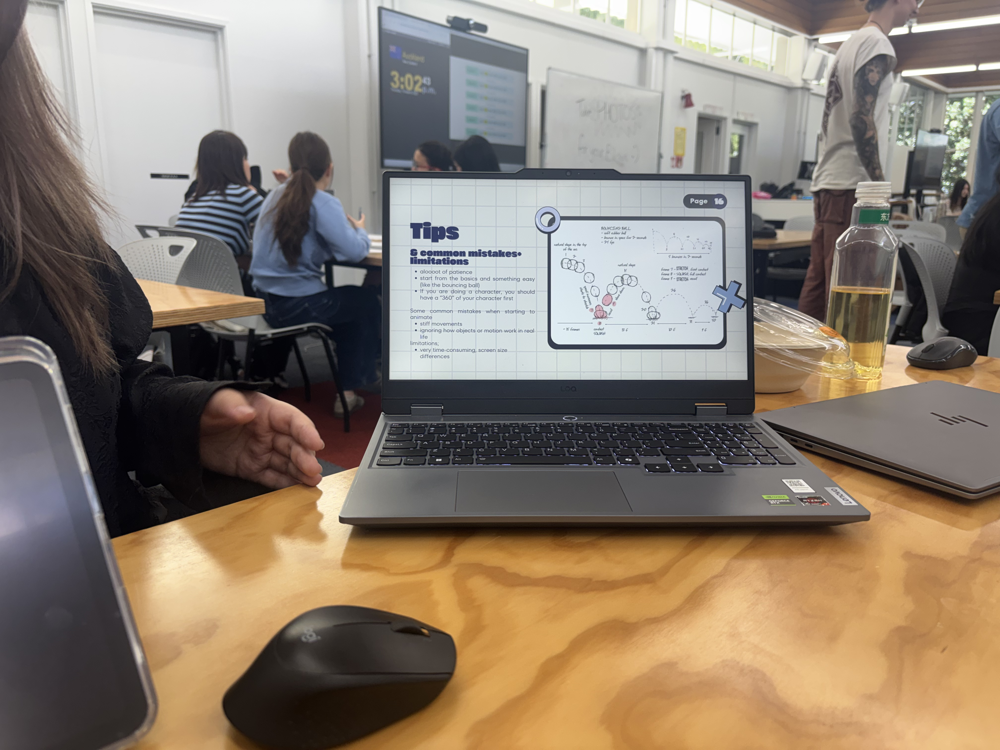

# Week 03

[← Back to Home](../index.md)

This week is the tech demo!

link to presentation slides: 
https://canva.link/j6cuvs56wlei8vi

me during presentation (my peers took the photo)

During the presentation I was really nervous and my words were just not coming out.

I think I definitely should've had a workshop so it would be more engaging? I think also it would be much more easier to explain the key points

Obviously I had to write a feedback based on my own presentation, I think it definitely should've been more "well done"? There were a few points I think was lacking. (i also got responses from my peers who viewed my presentation,) I think my goal would be to work on that, especially when I came down to presenting my capstone idea.

Currently, during this time in the process, I still want to think about what I want to do for my capstone. Learning from this week's tech demo, I think it would be beneficial for me to plan thoroughly ahead,

**Things I want to focus on:**

picking a topic (so what is my capstone about? the environment? a community?)
better refine my idea, Do I really want to be doing something so complicated? will I have time to do something super complicated?
Start thinking about the materials that I need, are any of these accessible to me?

## Positionality

My Positionality:

I am a 20-year-old student studying design in Aotearoa, New Zealand. I studied in China, Shanghai till I was 8 before migrating here with my family. My mother stays at home to take care of me, my younger sister, and my father, who is a skip-bin truck driver.
I see design as both a creative process and a way to solve real-world issues. Growing up here has taught me what design meant, but as time went on (and with the help of the internet), I was also able to see what design meant to those back home. (China, Shanghai) I have learnt to experiment with ideas, to be bold with choices and to understand how a community works (what a community needs to work better). Certain aesthetics may appeal and some that don't. Understanding how to solve a problem creatively also helped shape who I am today. I learnt to take on different approaches in tough situations. As someone who wasn't good at socialising and public speaking, presenting my projects has boosted my confidence and allowed me to be more open with people and also allowed me to better listen to my peers' or others' problems and then help solve them.
I know that my privileged access to education and technology shapes how I see design. To avoid bias, I try to listen to different perspectives and test my designs with a variety of users.
I am especially interested in designing for any real-life problems; this could be either for mental health, the environment, or a community. For me, design isn't just problem-solving but a way to connect, help others, and improve lives.

## More refined reflection

Reflection:
Overall, the feedback I got highlights that my presentation was visually appealing and contained relevant and insightful content. It shows that by using my own animation journey and personal work, I've demonstrated what success and failures looked like. However, several suggestions for improvement were noted, things like how the presentation felt too long, and the pacing had minor hiccups. And it was mentioned that there was a notable lack of "how-to" elements. My peers also expressed that they were expecting a more hands-on demo or something with deeper exploration of specific techniques like keyframes and onion skinning.

The suggestion for adding more "how-to" content and a practical demonstration was the most beneficial critique. These remarks were clear and useful, providing me with a clear path for development. No input seemed confusing or unclear. Instead, the comments were strengthened by their consistency across several responses. My self-evaluation was centred too narrowly on my delivery issues rather than whether I was meeting what the viewers wanted for a tech demo.
When I think back on my positionality, I see that I relied a lot on personal narrative as a secure approach to convey because I was still developing my technical expertise. This habit affected both how I presented the material and how I first understood the criticism, emphasising my performance issues rather than the technical limitations that others highlighted
Regarding how I felt about the feedback, looking back at my performance, truth to be told, it was horrible. I was nervous and kept stuttering. There were certain words I wished to express and explain better, but I just couldn’t. My peers had to help me, which shouldn’t have happened, considering this is my tech demo. 

In conclusion, the most important thing I discovered is that a tech demo needs to find a balance between practical and reflective storytelling. I'll make a few specific adjustments for my upcoming project or presentation in response to the comments. Like writing a script to help me feel less anxious and maintain a steady pace. Providing my peers a hands on workshop. Lastly, using my own work as a case study rather than the main objective, I will dedicate more time to fully explaining important technical topics.