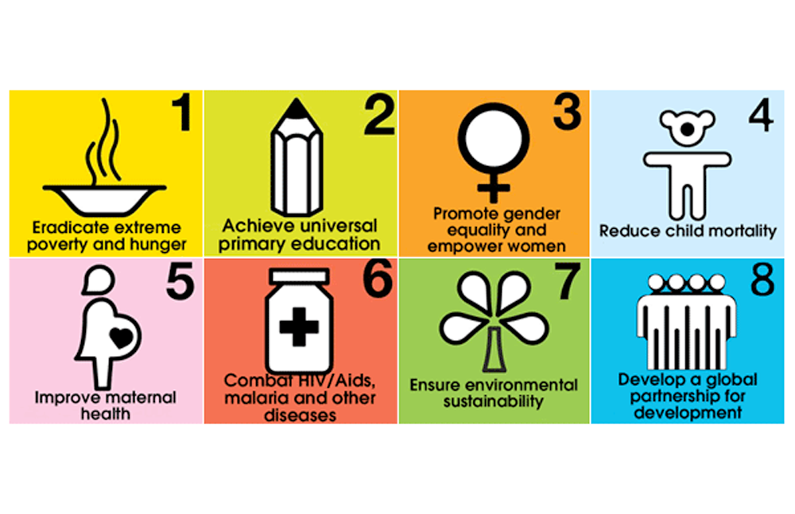
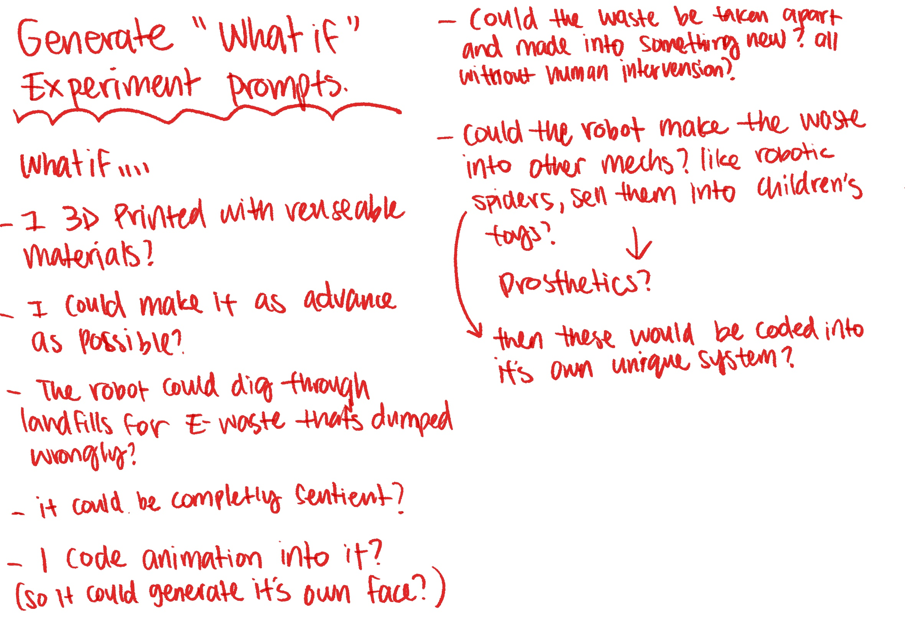
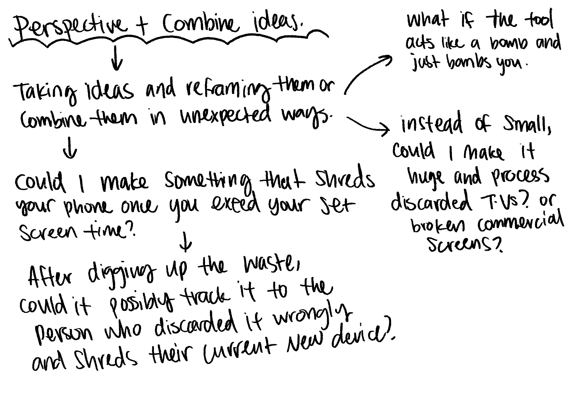
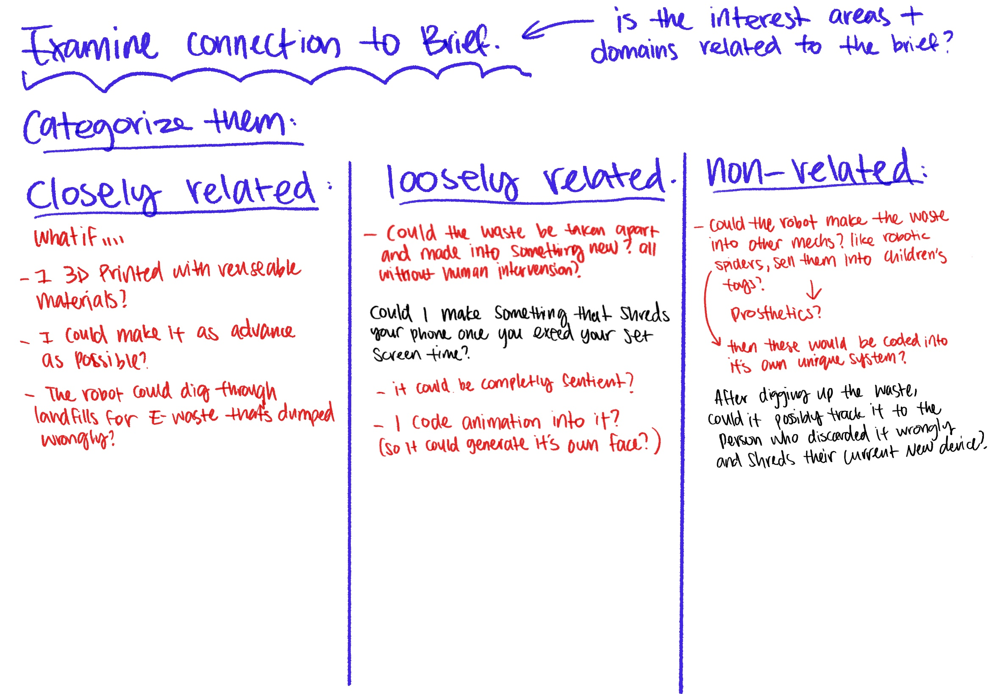
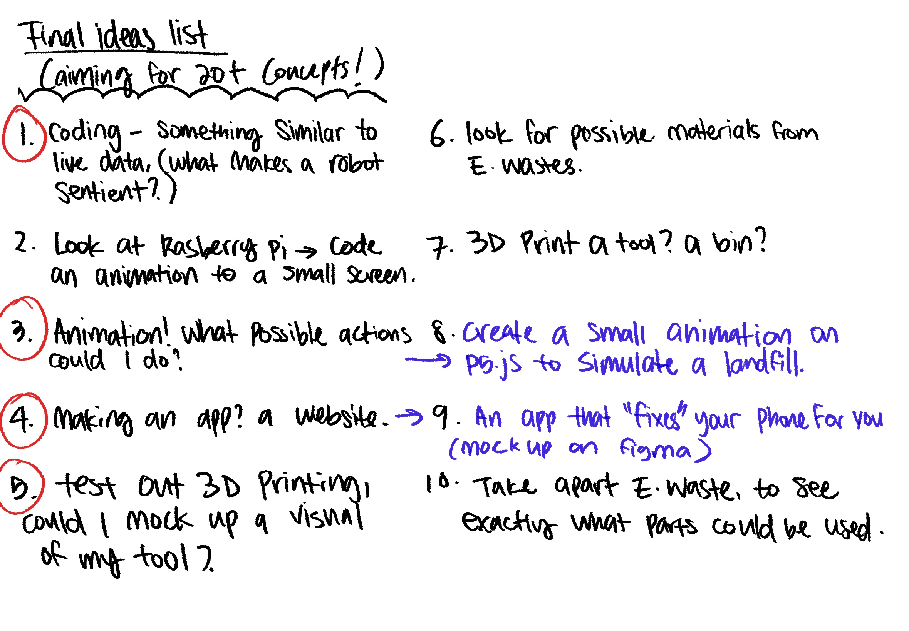
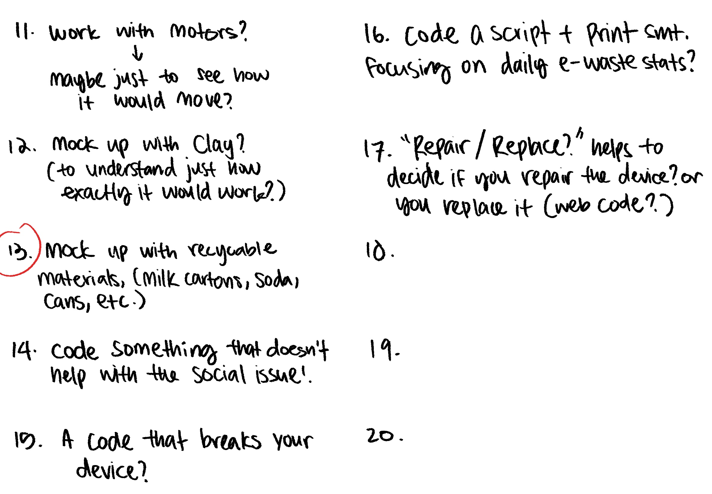
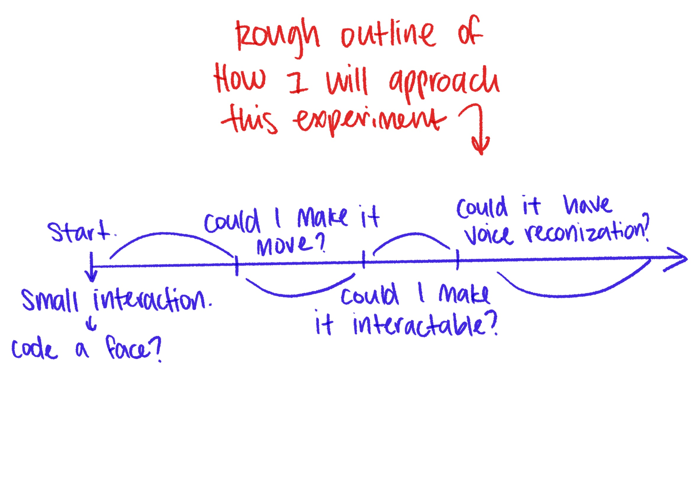

# Week 04

[← Back to Home](../index.md)

09/04/2026 

This week, we focused on planning our first experiment and prototypes. We also reflected back on the tech demo presentation. Although I wasn't in class for this, I will still reflect on the feedback I received.

#### **What did I appreciate the most about the peer review last week?**

Based on all the feedback I received, I really appreciated how all of them is offering me tips for future presentations. instead of having the presentations based on personal experiences I should more focus on the pratical parts. All comments were coming from a good place. 

## Experiment Planning

I started looking at my experiments with an ideation brainstorm. while keeping the Integrated Reflective Cycle in mind. I also looked at the ideation guide that was provided in Canvas. 

I first started by listing my interests, what excites me? What do I want to do? I knew I wanted to do something with coding, animation and even robotics. I want to take this time to not only explore different tools I could use for my projects but also learn and refine skills. I also listed some of the tools/ techniques that intrigues me. Which is doing more coding and 3D modeling and 3D printing. I would also like to do more hands on work. Lastly looking at what materials I would want to explore. I was thinking of working with silicone? resin? or I could farmiliarize myself with things like sensors, wires and all that tech stuff... But these definitely require some form of research first...

I then looked at connecting my interests to a broader domain. Asking myself,*"how can design contribute to a more meaningful change?"* or how could I let my design to engage in critical conversations? What social movements could I possibly look at that allows me to incorporate my interests? 

At the end, I decided to look into Climate justice (maybe specifically on E-waste?) Could I use my interests to make a tool? a robot? that helps sort through waste? could I create an animation to help raise awareness on the issue? 

I obviously need to have some research before thinking of how I should go about my first experiment, what is it that I need to watch out for and what should I focus on? 

#### **What is Climate Justice?**

Climate justice itself is a rather big scope, it frames global warming as an ethical and social issue, not just an environmental one, placing human rights at the center of climate action. It highlights marginalized communities and developing nations. Who contributes least to global emissions. Suffer the worst impacts and lack resources to adapt.

One important factor of both environmental justice and climate justice is that they are grassroots movements, which stress the need for communities to be involved in organising their own actions and deciding their own futures. While climate justice often involves putting pressure on large corporations or governments, this pressure comes from the people and not from above.

#### **Why choose E-Waste?**

It’s critical because it exposes the hidden, toxic underbelly of the green economy, which is an economic model that promotes sustainable development, improving human well-being and social equity while significantly reducing environmental risks and ecological deficiencies. 
Although we have solar panels, wind turbines or electric cars, the way they are made and disposed of are still the same. Not to also mention phones and other electronic devices. 

Environmental Justice is the fair treatment and meaningful involvement of all people regardless of race, color, national origin, or income with respect to the development, implementation, and enforcement of environmental laws, regulations, and policies. 

E-waste refers to discarded electrical or electronic devices. This includes a vast range of items reaching their end-of-life cycle, from large household appliances to small handheld devices.

Looking at the paper “Women, E-Waste, and Technological Solutions to Climate Change” by Lucy McAllister, Amanda Magee, Benjamin Hale. they raise their concerns the MDG goals

The writers say that solar panels and electric car batteries, which are popular climate solutions, will make e-waste worse, which hurts women and children more than men. This harm, which affects health, fertility, and child development, is caused not only by the unequal distribution of risks but also by the fact that institutions don't recognise women's roles and needs at work and at home. Women who don't have proper representation don't have health insurance or safety protections. The authors say that future climate agreements need to better include and recognise women waste workers and other groups that are often left out. They frame this as a matter of the right to health and climate justice.

After the brief research, I have decided on what I would like to make. ultimately I would like something that is a exhibition piece? something that provokes thinking. I would like to make it interactable too? So I choose to plan my experiments around this. 

I start with generating "what if" prompts, 

I also want to keep in mind that my experiments don't have to be for a good cause. What if I could make something so terrible for the enviroment/ my social issue? How could I shift my perspective and combine my ideas? 

After this, I categorized them, how closely related are they to my social issue? and is the interest areas + domains relate to the brief? (I would assume this is for choosing a stream path for capstone)

For the non-related ideas, how could I reframe? is there a way to adapt them so it could be closer to the brief?

In the notes I mention a robot that makes the waste into other mechs, like robot spiders and selling them into children's toy? (then it would be coded into it's own unique system?) or could it be used into prosthetics? 

-I would like to do something like this but then again...considering my non existent skills this feels wayy too complex. I want to focus on seeing if there are ways to make the tools to be sentient? 

After digging up the waste, could it possibly track it to the person who discarded it wrongly and shered their current newer device? 

-I think this could be less violent.. I like the approach though however, maybe it could be doing something more inconvinent? like code a program or an app that spam calls the owner? have it sent back to the discarder until they ethically get rid of the waste? 

#### **Final ideas list** 

For this, I am aiming to achieve 20+ ideas for my experiments. 

I circled the ones I want to focus on as possible experiment opportunity.

I tried listing 20 but seriously ran dry im sorry

so in summary, I wanted to do:

-Coding, something similar to live data, (could I make a robot sentient)

-Animation? creating a small animation on p5.js to sitmulate a landfill? 

-making an app or website

-test out 3D printing, could I mock up a visual for my tool? 

-mock up with recycable materials (milk cartons, soda cans, etc)

## Next steps? 

I want to experiment with coding first, it's something I haven't done before and it excites me that I am able to learn something new out of this, even better a skill. I also hope to discover new ways to code, learn why and how an equation works, and refine it enough to use it in my future projects. So in summary, 

#### **I want to explore ways to code to practice Java scripting to better understand why an equation works.**

To plan my approach for my first experiment, there are certain methods/ processes I will try:

-coding small actions
-make multiple prototypes
-incorporate vibe coding? (so using Ai to help with generating or fixing equations)

#### **So what is my first experiment?**

I want to experiment using p5.js to mock up an animated face for a robot. I want it to have some level of interaction, and I want to have at least one part of the code to move. 

#### **How will I structure my experiment?**
I would like to start off small, understand and then add more things onto it, this means documenting all the trials and errors. explaining why it didn't work the first time and what I could do to improve. Time wise, I would like this to be an "on going" kind of experiment, something I can add on whenever I have the time to. 

#### **Goals** 
Obviously, to make an animation that is interactable. For the specific objectives, I'm going to try not to use vibe coding and understand how the code would work organically. 

#### **Success Criteria**

-Final experiment resembles a face
-Some sort of interaction
-learned something new

Regarding the testing and documentation, I would use photos, screenshots, gifs and also providing a live website directly to the code. 

I will evaluate my results by constantly testing the code and ask for review from my peers in the week 6 crit. (what could I do better? what can I add more?) 

#### **Anticipate Challenges + Adaptability** 

Some challenges I think I would encounter would be the lack of technical skills, since I have never done things like this before. The constant curse of procrastination... and time constraints, I tend to be stuck on one thing and won't move on unless I solve it. 

However, I will adapt if things don't work as expected, If I do get stuck in one place, I will pivot towards a different approach. At this stage I want to focus on quantity instead of quality. 

If this experiment sparks new questions, I will record them and answer them at the end if I do have an answer, and If I don't I will keep it and explore into it as a new approach. 

## References

What is Climate Justice? (n.d.). 350 AOTEAROA. 
https://350.org.nz/what-is-climate-justice/

‌Women, E-Waste, and Technological Solutions to Climate Change. (2014). Health and Human Rights Journal. https://www.hhrjournal.org/2014/07/01/women-e-waste-and-technological-solutions-to-climate-change/

‌Image:
Millennium Development Goals. (2019). Gavi.org. https://www.gavi.org/about-us/global-health-development/millennium-development-goals

‌