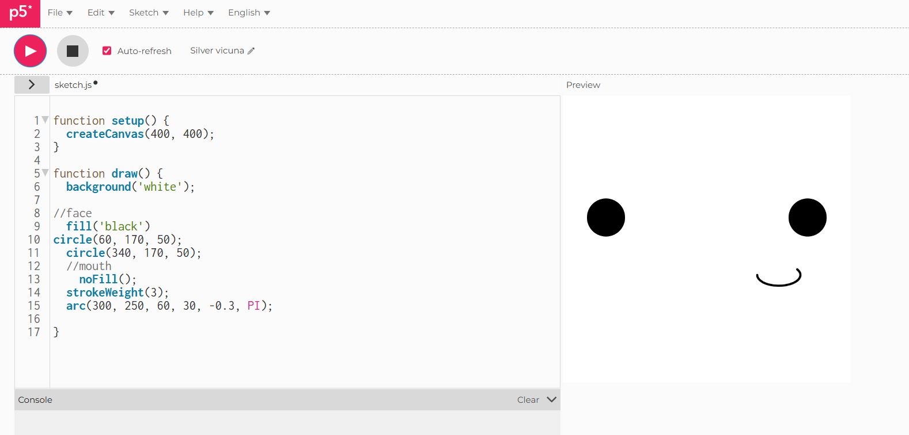
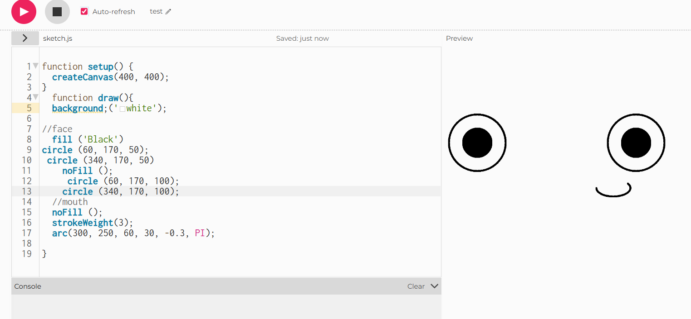
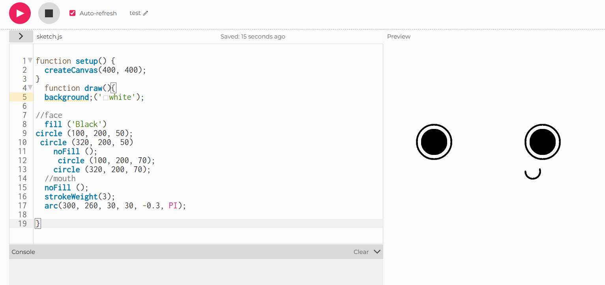

# Week 05

[← Back to Home](../index.md)

16/04/2026

## Starting Experiment 1

I started looking into experiment 1 on p5.js. I drafted out a face that I want to experiment, The goal I want to achieve with this experiment is having it have some sort of interactablity. 

I will be using the official reference website of p5.js. *(p5.js, 2019)*

I want the face to look more cartoonish. So I first set up my blank canvas and started drawing 2 circles and filled them in. I used the circle function References from the p5.js website. *(circle, 2025)* 

A circle is a round shape defined by the x, y, and d parameters.

x of the center of the circle.and y set the location of its center. d sets its width and height (diameter). Every point on the circle's edge is the same distance, 0.5 * d, from its center. 0.5 * d (half the diameter) is the circle's radius. 

So for my function, for the eyes I used:

fill ('Black') ---> because I wanted it to be a black pupil 

Circle (60, 170, 50); ---> Circle (x, y, d)
 
 Circle (340, 170, 50);---> the right eye 

 I understood this function since it's quite strightforward? I mean you just type in the shape and then adjust the position on the canvas. I also already had some base knowledge with how to code this, so it seemed easy. 

 I then looked through the reference, *(arc,2024)*, for how to make the mouth, I initially wanted to just do a line, but it felt bland and kinda ugly, so used the arc function. 
For the mouth I used: 

noFill ();
  
  strokeWeight(3);
  
  arc(300, 250, 60, 30, -0.3, PI);

First, noFill ensures the arc will not be filled with any colour, so only its outline will be visible. strokeWeight(3) makes the outline 3 pixels wide. The arc command draws the curve. The first four parameters define the bounding box of the ellipse centred at (300,250) with a width of 60 pixels and a height of 30 pixels. The last 3 parameters define which part of that ellipse to draw, so start at an angle of -0.3 radians (about -17 degrees) and end at pi radians (180 degrees). There is no 5th parameter, so it defaults to drawing the open arc (not a chord or pie slice). So what you get is a thin line, unfilled, curved, from just above the rightmost point of the ellipse to the leftmost point.

I am relatively happy about this, I think it does look a bit unsettling though. But this is a solid start. 

17/04/2026

I had a solid start, but I really don't like how creepy it looked, and not cartoonish enough for me? maybe it will be better if I added another outter circle to the eyes? and the black part could be the pupil

..yeah maybe its the eye distance kinda issue. 

great now its cuter, I changed the eye distance to be closer and shrinked the outter circle so it looks less like it's staring into my soul. I also changed the size of the arc. Overall I would like to think the face looks more friendly? less smug?? who knows but I like this version better... 

The next thing I would like to work on would be making this interactable. (since I am simulating a face for a robot) I thought, what if the pupil followed the curser while it's on the canvas? (simulating camera tracking) 

I struggled with finding references on what I needed to code in the mouse tracking. Which was bad considering I also wanted to cut down on time, again I was aiming for more quantity and I didn't want to rely on vibe coding (using AI for code). I did however, find an example of nearly exactly what I was doing on p5.js!

This example code I found also explains how to make the face blink, which was something I didn't think about when planning out my experiment. Which allows me to think that the robot itself could also behave more sentient. 

<iframe src="https://editor.p5js.org/ezha440/full/DZ4Gexvmg" width="400" height= "400"></iframe>

*I also had help from my peers so I could add the actual function into the blog :) 

I noticed there is a function called let blinkDuration = 200, and I wonder how that code works. After going through the example I have comed to the conclusion:

The blink duration is simply how long the face’s eyes stay closed during each blink. This code makes the character blink by drawing lines instead of eyes for a short period. The blinkDuration variable controls that exact amount of time, starting at 200 milliseconds (which is just 0.2 seconds). But to make the character feel more alive and less robotic, the programme randomly changes the blink duration after every single blink. Sometimes the character blinks very quickly (0.1 seconds), and sometimes it holds the blink a tiny bit longer (0.3 seconds). This randomness mimics how real people blink at slightly different speeds each time, making the face feel more natural and unpredictable rather than blinking like a machine with perfect timing.

There's also something called mouseX on the canvas *(mouseX, 2024)*, after looking through, I have come to the conclusion: 

The mouse following pupils makes it look like the eyes are watching your cursor as you move it around the screen. The code uses a map to determine exactly where to place each pupil based on your mouse position. As the mouse moves from the far left edge of the canvas to the far right edge, the left pupil smoothly slides from the left side of its eye to the right side, and the right pupil does the same in its own eye. The same thing happens vertically as your mouse moves up and down; both pupils move together inside the eye sockets. This creates the illusion that the character is actually tracking your movements and following your mouse around the screen, just like real eyes would follow a moving object. The pupils never leave the white part of the eye because the map function keeps them safely inside the eye boundaries, no matter where the mouse goes.

## **Applying to my own work**

Now that I have a better understanding to the function, I will apply to my own function. 

<iframe src="https://youtube.com/shorts/kcKJRS9SOYk?feature=share" width="400" height="800"></iframe>

## References

arc. (2024). P5js.org. https://p5js.org/reference/p5/arc/

‌
circle. (2025). P5js.org. https://p5js.org/reference/p5/circle/

‌
p5.js. (2019). p5.js | reference. P5js.org. https://p5js.org/reference/

mouseX. (2024). P5js.org. https://p5js.org/reference/p5/mouseX/

‌