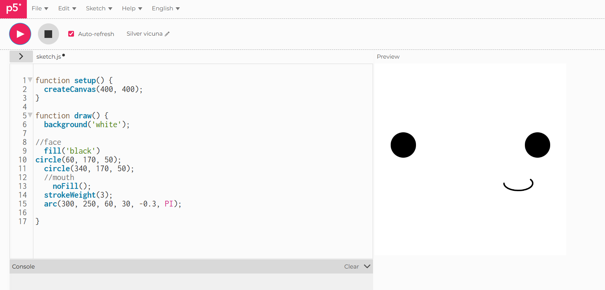
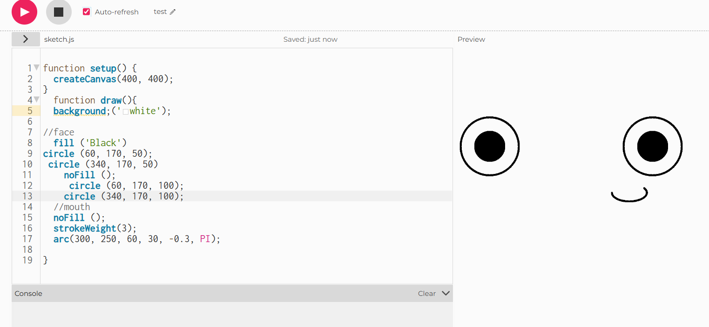
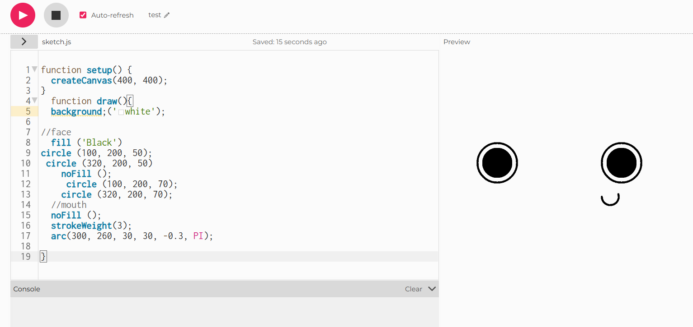
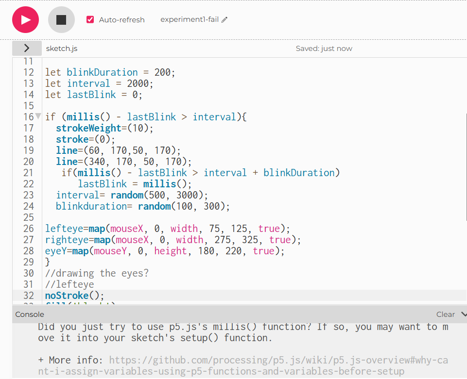
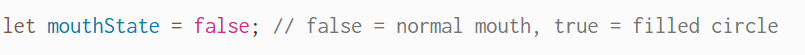
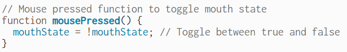
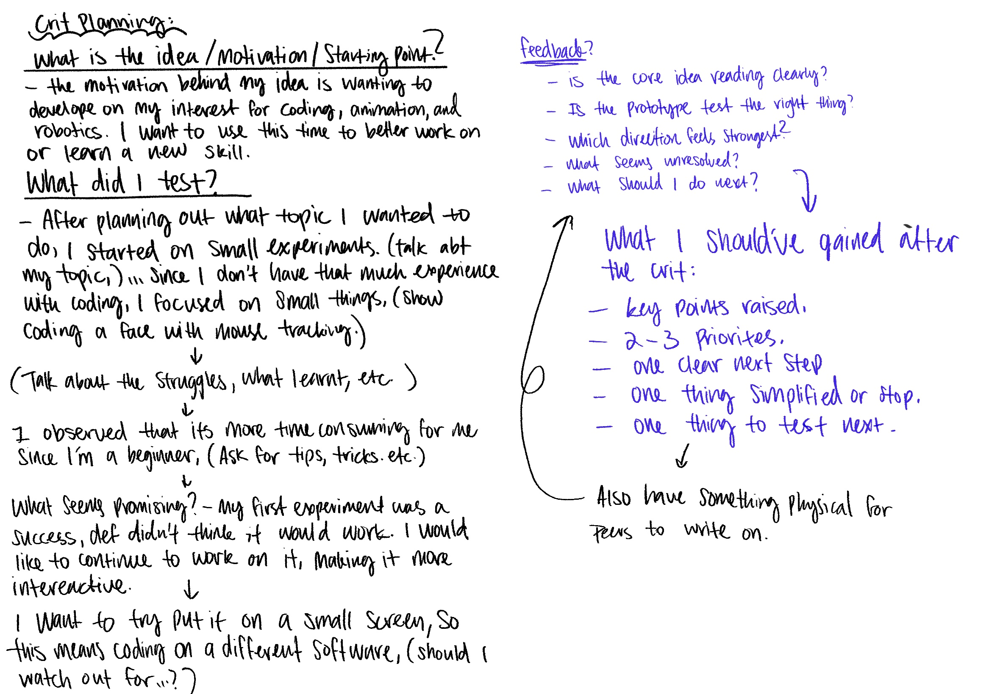

# Week 05

[← Back to Home](../index.md)

**16/04/2026**- Phase 1

# **Starting Experiment 1**

I started looking into experiment 1 on p5.js. I drafted out a face that I want to experiment, The goal I want to achieve with this experiment is having it have some sort of interactablity. 

I will be using the official reference website of p5.js. *(p5.js, 2019)*

I want the face to look more cartoonish. So I first set up my blank canvas and started drawing 2 circles and filled them in. I used the circle function References from the p5.js website. *(Circle, 2025)* 

A circle is a round shape defined by the x, y, and d parameters.

x of the center of the circle.and y set the location of its center. d sets its width and height (diameter). Every point on the circle's edge is the same distance, 0.5 * d, from its center. 0.5 * d (half the diameter) is the circle's radius. 

So for my function, for the eyes I used:

fill ('Black') ---> because I wanted it to be a black pupil 

Circle (60, 170, 50); ---> Circle (x, y, d)
 
 Circle (340, 170, 50);---> the right eye 

 I understood this function since it's quite strightforward? I mean you just type in the shape and then adjust the position on the canvas. I also already had some base knowledge with how to code this, so it seemed easy. 

 I then looked through the reference, *(Arc,2024)*, for how to make the mouth, I initially wanted to just do a line, but it felt bland and kinda ugly, so used the arc function. 
For the mouth I used: 

noFill ();
  
  strokeWeight(3);
  
  arc(300, 250, 60, 30, -0.3, PI);

First, noFill ensures the arc will not be filled with any colour, so only its outline will be visible. strokeWeight(3) makes the outline 3 pixels wide. The arc command draws the curve. The first four parameters define the bounding box of the ellipse centred at (300,250) with a width of 60 pixels and a height of 30 pixels. The last 3 parameters define which part of that ellipse to draw, so start at an angle of -0.3 radians (about -17 degrees) and end at pi radians (180 degrees). There is no 5th parameter, so it defaults to drawing the open arc (not a chord or pie slice). So what you get is a thin line, unfilled, curved, from just above the rightmost point of the ellipse to the leftmost point.

I am relatively happy about this, I think it does look a bit unsettling though. But this is a solid start. 

**17/04/2026**- Phase 2

I had a solid start, but I really don't like how creepy it looked, and not cartoonish enough for me? maybe it will be better if I added another outter circle to the eyes? and the black part could be the pupil

..yeah maybe its the eye distance kinda issue. 

great now its cuter, I changed the eye distance to be closer and shrinked the outter circle so it looks less like it's staring into my soul. I also changed the size of the arc. Overall I would like to think the face looks more friendly? less smug?? who knows but I like this version better... 

The next thing I would like to work on would be making this interactable. (since I am simulating a face for a robot) I thought, what if the pupil followed the curser while it's on the canvas? (simulating camera tracking) 

I struggled with finding references on what I needed to code in the mouse tracking. Which was bad considering I also wanted to cut down on time, again I was aiming for more quantity and I didn't want to rely on vibe coding (using AI for code). I did however, find an example of nearly exactly what I was doing on p5.js!

This example code I found also explains how to make the face blink, which was something I didn't think about when planning out my experiment. Which allows me to think that the robot itself could also behave more sentient. 

<iframe src="https://editor.p5js.org/ezha440/full/DZ4Gexvmg" width="400" height= "400"></iframe>

*I realized that this window doesn't allow u to see the whole scripting part, so here is the link. I didn't put screenshots because it would be too small to read as an image and it's also...not that important: https://editor.p5js.org/ezha440/sketches/DZ4Gexvmg 

I also had help from my peers so I could add the actual function into the blog :) 

I noticed there is a function called let blinkDuration = 200, and I wonder how that code works. After going through the example I have comed to the conclusion:

The blink duration is simply how long the face’s eyes stay closed during each blink. This code makes the character blink by drawing lines instead of eyes for a short period. The blinkDuration variable controls that exact amount of time, starting at 200 milliseconds (which is just 0.2 seconds). But to make the character feel more alive and less robotic, the programme randomly changes the blink duration after every single blink. Sometimes the character blinks very quickly (0.1 seconds), and sometimes it holds the blink a tiny bit longer (0.3 seconds). This randomness mimics how real people blink at slightly different speeds each time, making the face feel more natural and unpredictable rather than blinking like a machine with perfect timing.

There's also something called mouseX on the canvas *(MouseX, 2024)*, after looking through, I have come to the conclusion: 

The mouse following pupils makes it look like the eyes are watching your cursor as you move it around the screen. The code uses a map to determine exactly where to place each pupil based on your mouse position. As the mouse moves from the far left edge of the canvas to the far right edge, the left pupil smoothly slides from the left side of its eye to the right side, and the right pupil does the same in its own eye. The same thing happens vertically as your mouse moves up and down; both pupils move together inside the eye sockets. This creates the illusion that the character is actually tracking your movements and following your mouse around the screen, just like real eyes would follow a moving object. The pupils never leave the white part of the eye because the map function keeps them safely inside the eye boundaries, no matter where the mouse goes.

## **Applying to my own work**

Now that I have a better understanding to the function, I will apply to my own function. 

I start by adding different states to the canvas codes. things like Blink duration, blink intervals, and last blink time. I figured to just use the example and just transfer certain codes to my own one, however it didn't work when I attempted to run it. 

The system notified me that my "millis" wasn't defined. At first I couldn't figure out where exactly I didn't define the millis. 

Turns out, the millis code isn't working because I accidentally wrote the “if” statement and everything after it outside the draw function. Since the draw function needs { } that wrap around all the code that should run repeatedly. In this version of my code, I had also closed the draw function too early, right after the background('white'). So the blinking logic, eye mapping, and drawing commands never actually run. 

While attempting to fix this function, I was pausing and slacking off alot, because I had bump into an issue I had no idea how to fix,(which was a challenge I anticipated happening) being stuck to view this for hours on end I was start to feel burnt out. 

But when I did get this fixed, it was oddly satisfying and although I no longer had the motivation to do this (for now) It was a good learning curve. 

<iframe src="https://editor.p5js.org/ezha440/full/SoTAbg2GK" width="400" height="400"></iframe>

 https://editor.p5js.org/ezha440/sketches/SoTAbg2GK 

Some things I have changed for my experiment is the thickness of the lines, I needed it to look more chunky? if that make sense and just overall cuter looking. I also made the canvas size bigger so the mouse would have more space to move. I applied what I have learnt (blink duration, mouse tracking) and honestly, I am kinda proud? 

I would consider my experiment a success, but I feel like that's just too boring? maybe I could also look at making the mouth move as well? could I possibly animate it well enough through Java scripting? 

**18/04/2026**- Phase 3

The experiment has hit the goals I have set myself during planning, it has some level of interaction. But I wonder if there is a possiblity for me to do more? could I possibly push myself at this stage so it could be used in future projects? 

After much consideration, I wanted to script an action that when mouse is clicked, the mouth of the face would animate into something else. When browsing through the p5.js references website I did see the tab for Mouse Pressed(). So in a way, I am also experimenting another new function I haven't worked with before. 

Mouse Pressed *(MousePressed, 2024)* is a special button trigger in the code. It's a built-in function that automatically runs a block of code. Every time the mouse is pressed down (not when released), it instantly flips the mouth switch, so the mouth toggles between state a and state b. 

since the face currently only has an arc for "mouth" I chose to use the circle function to create a surprised look. (state a- arc, state b-circle)

<iframe src="https://editor.p5js.org/ezha440/full/VzENOyIQg" width= "400" height= "400"></iframe>

https://editor.p5js.org/ezha440/sketches/VzENOyIQg 

In this case, the mouthState variable is set to act as a switch command for whether the character has a normal mouth or a surprised, open mouth. It starts with “false”. (could be understand like having a resting face) But when the mouse is clicked anywhere on the canvas, the mousePressed function is called, and that switch gets flipped. so instead of the arc it would switch to the circle. The code draws a filled black circle when mouthState is set to "true". 
So each time the mouse is clicked, it switches between these two expressions. 

## **Reflection on my experiment- overall**

Overall, I would consider this a sucess, I had fulfilled my goals, which was:

**-Final experiment resembles a face.**

**-Some sort of interaction.**

**-learned something new.**

However, I did have challenges with my lack of skill, time management and being stuck on one problem when I could've adapted (working on something else). I noticed that this isn't the best way to be working efficiantly, and I will be more mindful of how to approach similar works in the future. 

# **Crit Planning**

**19/04/2026**

Crit and Crit planning is something I haven't done before so the slides provided was really helpful. 

I wanted to focus on a few things for my crit, what I want to showcase and what I need feedback on.  

**-What is the idea/motivation/ starting point?**

So I would talk about my social issue, (why i chose it,) what provoked my idea for the experiment, how will that relate to my interests?

**-what Is my biggest uncertainty right now?** 

I wanted to ask whether my social issue (climate justice more focus on E-waste) is a good topic. While working I feel like I am almost forcing a connection to my interests. I would also like to explore other options too. 

If I were to do a physical prototype, what could I do so it feels more like a prototype? Should I make up something and 3D print it? (since It's also within my intrest in testing out new tools and materials.) or is Java scripting and coding more important at this stage?

**-What did I test?**

I would have a brief walk through of my experiment 1. My goals, initial thinking, the struggles and what I have learnt. What I observed while working on it. 

**-what seems promising? and whats next? and what should watch out for?**

I will then talk about how it was a sucess. And for next steps I would like to try putting it on a small screen, so this would mean working with a different software. 

I also have a clear idea of what I want for feedback.

- is the core idea reading clearly, 
- Is the experiment test the right thing? 
- which direction feels strongest? 
- what seems unsolved? 
- What should I do next?

I was also thinking of letting my peers write down the answer on something physical as I present my work. 

**What I should've gained after the crit**

- key points raised
- 2-3 priorites
- one clear next step
- one thing simplified or stop 
- one thing to test next

## References

Arc, (2024), P5js.org, https://p5js.org/reference/p5/arc/

‌
Circle, (2025), P5js.org, https://p5js.org/reference/p5/circle/

MousePressed, (2024), P5js.org, https://p5js.org/reference/p5/mousePressed/

MouseX, (2024), P5js.org, https://p5js.org/reference/p5/mouseX/

‌
p5.js, (2019), p5.js | reference. P5js.org. https://p5js.org/reference/

‌

‌