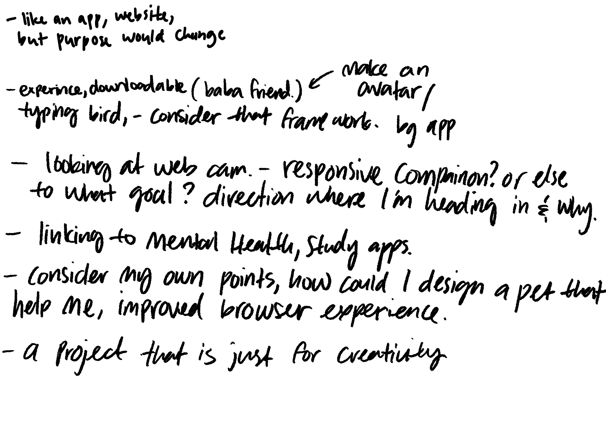
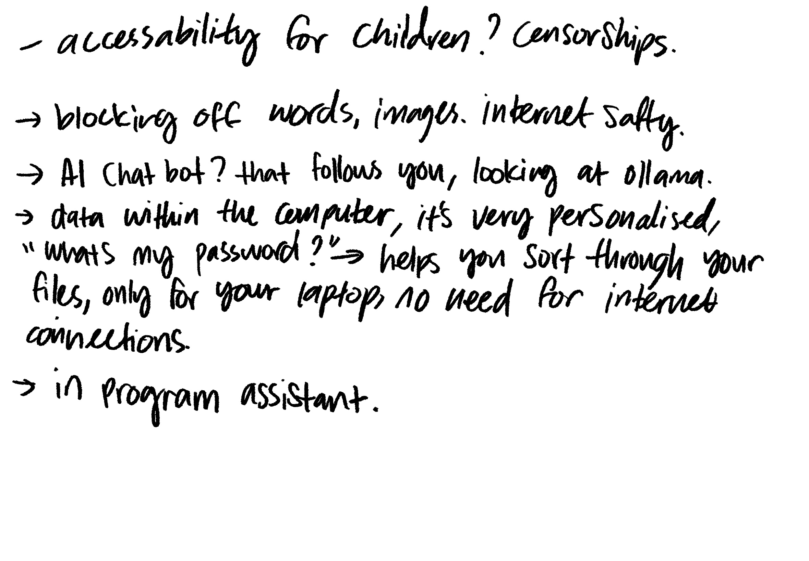

# Week 06

[← Back to Home](../index.md)

**23/04/2026** 

## **Crit in sesh!**

This week we approach the critique session, I am excited to present my work to my peers, this way I could see my experiment and approach from a different perspective, which in my opinon is an important part of the design process. 

I didn't make a slide for my crit, just because I had all the hand written notes, I found it easier to just ramble off the notes I wrote. (it's somehow easier for me in terms of thought process.)

I talked about the ups and downs of my experiment, my thought process, why I chose my social issue and presented my inquiries.

- is the core idea reading clearly, 
- Is the experiment test the right thing? 
- which direction feels strongest? 
- what seems unsolved? 
- What should I do next?

Although I did plan for the feedbacks from peers to be written down on something physical, I ended up just scribbling them down on my ipad. 

I really appriciated all the comments and feedback on my work/ current experiment. I was informed that this seems like an okay path to travel down, and since my social issue is a bigger scope I don't have to focus on E-waste.

During the crit, I asked whether making a robot seem like a solid next experiment. Since my concern was time consumption and just the overall lack of skill. I mentioned the road blocks I encountered during experiment one and also kept in mind that after the crit we also needed to plan our next experiment.

One of the suggestion I received was to instead of looking at modeling a robot I could work on an app, a website, however the purpose would change. 

Anothoer suggestion I found interesting was to make a desktop friend. An experiment users could download, this would not only allow me to include coding/scripting, it would also allow me to animate frames (which allign with my interests!) 

My peers mentioned that I could keep in mind things like, can the desktop friend be a responsive companion? or could it be something else? If I were to do this for the next experiment, what direction would I head to and why? 

It is possible to also link this to mental health- the desktop friend could be looked at being a study companion. Something I really appericiated was the mention of **looking at what I would want,** so how would I design a pet that helps me improve my study or overall browser experience. This was a perspective I haven't considered at all.

Another point that was bought up was whether this could be child safe. The desk top pet could take away/ block explicit ads on websites so children would have a safer enviroment while on the web. 

Is it possible to have an offline AI chatbot (like ollama) that follows you. So something that takes only the data that exsits in your computer? Or could it be an assistant for recording and helping you with the passwords? Sort through your files for you? like a background worker and since it's offline, nothing is leaked. 

It feels good to have my work critically reviewed and provided different perspectives, I find myself having a more clear understanding on what I should be doing, so I would move onto planning my next steps.

## **Next steps, what will I plan next?**

It's interesting, the concept of making something for me instead of looking into a bigger scope? It's something different to the usual design projects where we have a certain list we need to fulfill? Never really about what me as a person wants or needs? It served as a solid reminder. 

With the desktop pet/ companion I have had experience with similar applications like shimeji browser extension when I was younger. 
"Shimejis are cute little desktop pets that wander around your screen and play with your windows. They walk, crawl, climb and interact with web pages in Google Chrome when you have installed the Shimeji Browser Extension."(*Shimeji Browser Extension*, 2025)

There are also similar projects I have seen online while scrolling through instagram from time to time, Like this one by zackjwilk where they create a desktop tamagochi that dies if you don't do your homework. ↓

https://www.instagram.com/reel/DRiAdFIjlxn/?igsh=emFlM2N6aThraXR

Which has me thinking, could I possibly make something similar, a desktop extension that pressures me into doing work and helps me with time management? (Call me lazy but I seriously need to fix my procrastination issue) 

**What does this mean for my original social issue?**

This is a big change to what I initially want to do, but I want to explore the different tools possibilities that are available. So I'm branching out to develop my skills and see if I could take what I learnt and use it for future projects. 

### **So what is my second experiment?**
**To make a browser companion that monitors me with my work and help with procrastination issue.**

## **What possible tools could I use to conduct this experiment?**

I could continue using p5.js but I would love to have this be a actual working desktop pet. I will look into using GDscript and Unity, or Shimeji! which uses Javascript. 

## **Goals**

For this second experiment,  I would like to;

- Have a moving character? some resemblence to a shimeji
- at least 3 different movements for the character 
- learn and improve the choice of tools, conduct experimenting with either, GDscript, unity or shimeiji browser extension 

For personal goals (none technical),I would like to;

- Not procrastinate.
- arrange appropriate time slots for the work
- still try and not use vibe coding? 
- record with proper screenshots, notes, etc. 

#### **How will I structure my experiment?**
I will remember to document everything thoroughly, again starting small, make sure I understand how each thing works so I could use it in future work. 

Regarding the testing and documentation, I would use photos, screenshots, gifs and also providing a live extension.  

I will evaluate my results by constantly testing the code and ask for review from my peers in the week 6 crit. (what could I do better? what can I add more?) 

#### **Anticipate Challenges + Adaptability** 
The struggle of working with a new application, If I do get stuck I will learn from week 5 and adapt better and try not to burn out as fast. 

Another challenge will be if the extension would even install? I wonder if it has to be public? 

## **What will I focus/ do next week?**
- come up with a character design I want to do
- draw at least 3 frames of movement
- A more indepth touch up on the applications I will use.

## References

Shimeji Browser Extension. (2025). Shimejis.xyz. https://shimejis.xyz/

Zack on Instagram: “Waiting for Google to approve it as a Chrome extension😳😳 #compsci #programming #code #college #zack.” (2019). Instagram. https://www.instagram.com/reel/DRiAdFIjlxn/?igsh=emFlM2N6aThraXR

