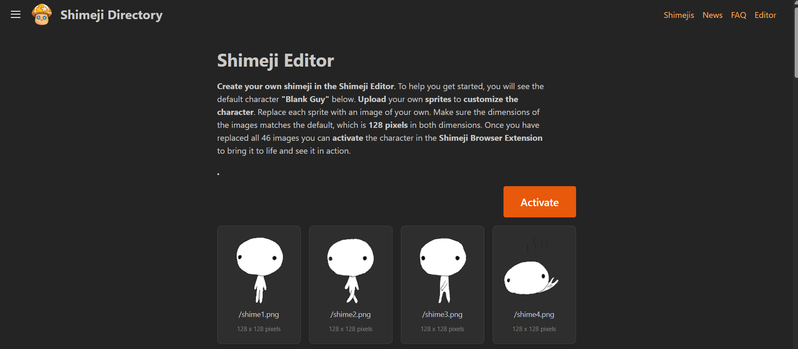
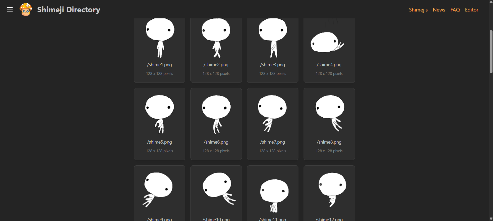
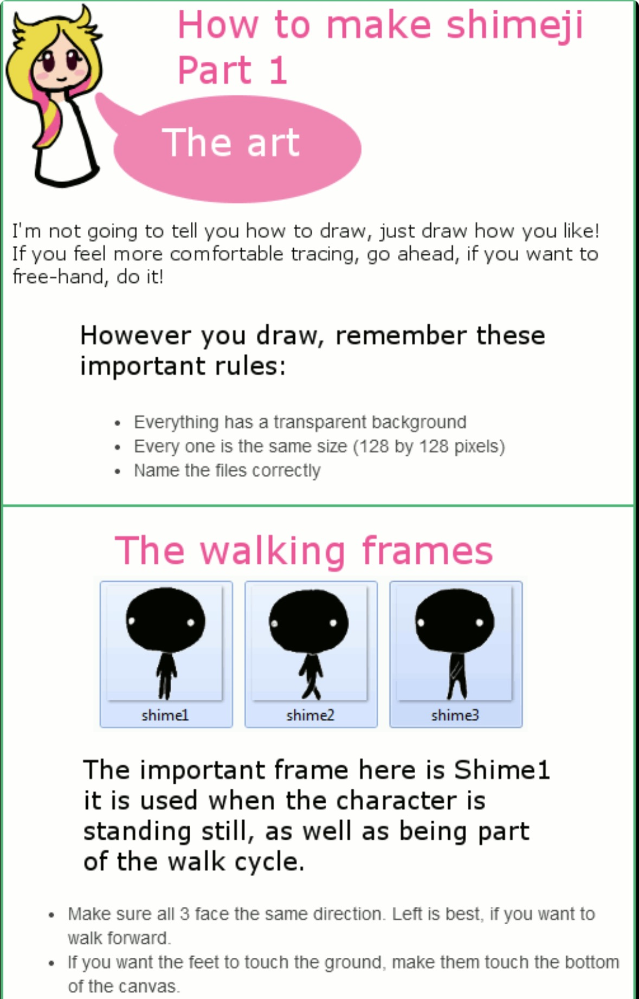
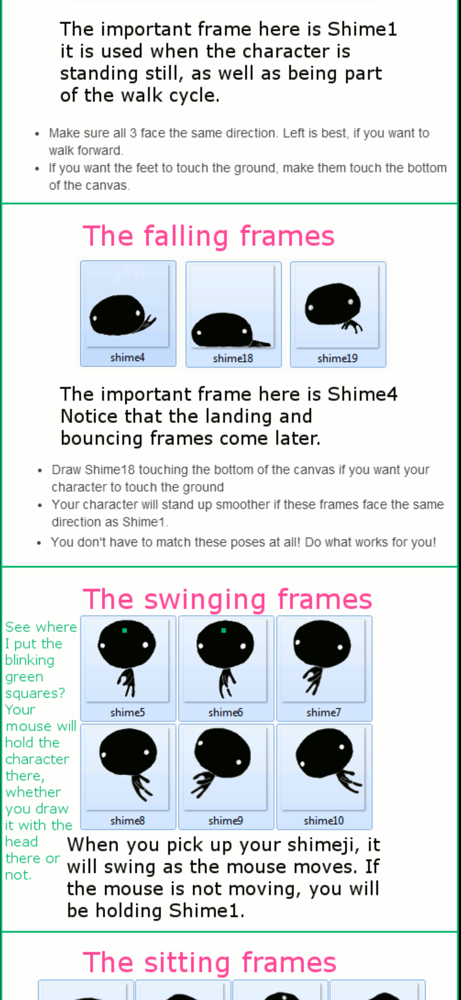
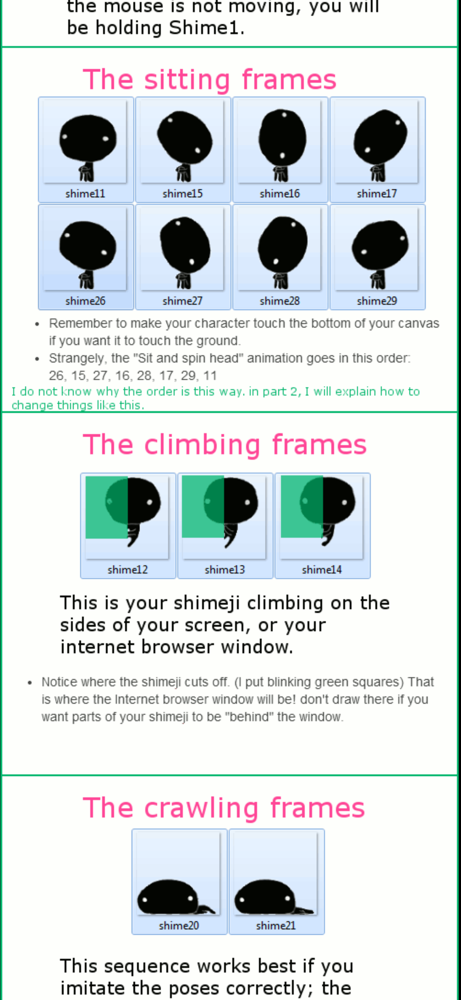

# Week 07

[← Back to Home](../index.md)

## Documentation 
**30/04/2026** 

# **Starting Experiment 2**

For this experiment, I needed to do some research on how exactly to make a shimeji, despite having access to it when I was younger, I just assumed it was a bunch of drawn frames put together triggering a series of animation for movement. 

I first looked at Shimeji Editor, which already gives me a template that allows me to replace each sprite with an image of your own. Make sure the dimensions of the images matches the default, which is 128 pixels in both dimensions. Once you have replaced all 46 images you can activate the character in the Shimeji Browser Extension to bring it to life and see it in action. (Shimeji Editor.2026)

https://shimejis.xyz/editor

(this is only accessable outside of the university account...so I had to do this on my own account.)

This was easy enough (watch this bite me back in my own butt later) So I started drawing in our trusty tool, Procreate, I first made a new canvas the exact pixels needed, and started drawing. I wanted to focus on the first ten frames. 

For my character/browser avatar, I wanted to draw something from one of my favourite games (Splatoon 3), and I settled on this squid. 

From Shime1 to 3 frame, I can tell it's the walking animation frames, I wanted my character to bob up and down while walking, (kinda like the pac man ghost thingy?) 

I also decided that I want to finish all the frames before running the shimeji (this action may have consequences...)

Since the frames don't have names stating what action it's portraying. I decided to look online to see if there's any other guides for this.

https://www.deviantart.com/akizakura16/art/Make-a-Shimeji-Part1-the-art-472702230

I used this one from Deviant art, (because I was working on ipad it was easier to zoom in on the strip of gif that is there) The author has help explain what each frame make your avatar does, along with tips with how to draw. 

Here's what I looked at for the walking frames,

And this the reference of what I looked at for the next few frames I chose to work on. 

I kept a mental note on the shime 4 frame, and the notes on how to make my character stand up smoother in the animation. Since my character is designed to be pretty flat. I don't think it would be much of a problem.

  

--> shime 4, shime 18 and shime 19

I wanted to draw how my character in the game would look if they are falling, which will then be shifted to them landing in a puddle of ink (because...squid...ink..get it...)

Keeping an eye on time, It's also one of my goals to not procrustinate while doing this. Compared to the previous experiment, this is much more relaxing since I am just drawing. For each day, I would like to at least completing 10 frames, while also giving myself time to document my process. 

(I also found a gif converter so I could give myself a preview of what my drawings put together looked like)

The next frames I would be working on is the swinging frames.

-->frames shime 5-10

Short gif to demo how it would potentially look while being dragged

Shime frame 5 and 6 are what the character will look like when It's picked up. And frame 7 and 8 is what It would look swinging to the left, and frames 9 and 10 is what it would look like swinging to the right. I want to keep the movements and design much simpler so I only change the expressions and use the same base to remain consistant. 

**01/05/2026**

I continue to work on to fill in the 46 frames. Today's goal is to do more now that I have developed a system of just using the same body and eye base. Having a stable color pallete too helps with that consistency. 

Looking at the notes provided for the sitting frames, I figured to use animation assist on procreate to help with getting the exact effect I'm looking for, the goal is to have my character look like it's melting into a blob. 

I also kept in mind the author's note about the animation frame order being a bit bizzare. 

--> Frames 11-17, and 26-29

Here are all the frames, and here is a gif of what the animation looks like. 

The onion skin really helped to invision how I wanted the character to "melt down" and I added little notes to fill up the blank space. Again, just trying to keep this as simple as possible considering the style I'm trying to go for.

Next is the climbing frames and the crawl frames

--> climbing Frames 12-13

I wanted to continue the motion of the avatar "bobbing up and down" using lines to indicate it moving. but also keeping in mind where it will sit once being installed into the browser. 

--> Crawling Frames 20-21

**02/05/2026**

The next thing I worked on was the jumping frame, ceiling frames and also leg swinging frames. 

Jumping frame 22

At this point, I wanted to cut corners because it was taking a solid chunk of my time. Taking the author's advice, I decided to just rotate the climbing frames and call it a day. 

Ceiling frames 23-25 

Since my character don't actually have dangling legs, I consider drawing legs onto the character but it felt weird. So I ended up just making a bunch of experssions. (also at this point I feel like the avatar is a bit boring?)

"leg swinging" frames 30-33

I was getting real sick and tired of dragging this frame drawing thing on, so instead I just choose to make them all in one go and then test them. My original plan was to do all the frames in one day...but that certainly got pushed back since I didn't take into account how long this is actually going to take? Which surprised me considering that I have been using a set of templates as well.

The next is the browser stealing frames and two sets of multiplying frames. 

--> add example img here 

Frames 34-37 

The first set of multiplying frames focuses on my avatar pulling up a duplicate version of itself from the bottom, 

Frames 38-41

Lastly, the second set of multiplying frames, this one feels a bit more freaky? Because it shows my character splitting into two. (I know I could change the way it splits but I think it would be funnier if I kept it lol)

I would say, this is the frames I struggled the 
## References

Shimeji Editor. (2026). Shimejis.xyz. https://shimejis.xyz/editor

Make a Shimeji (Part1 the art) by Akizakura16 on DeviantArt. (2014, August 4). Deviantart.com; DeviantArt. https://www.deviantart.com/akizakura16/art/Make-a-Shimeji-Part1-the-art-472702230

‌