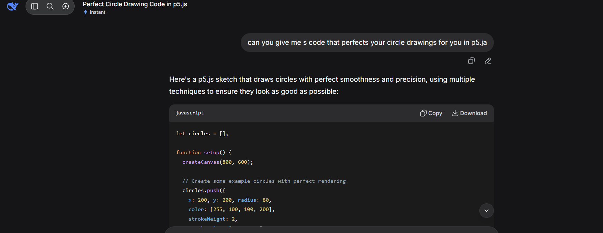
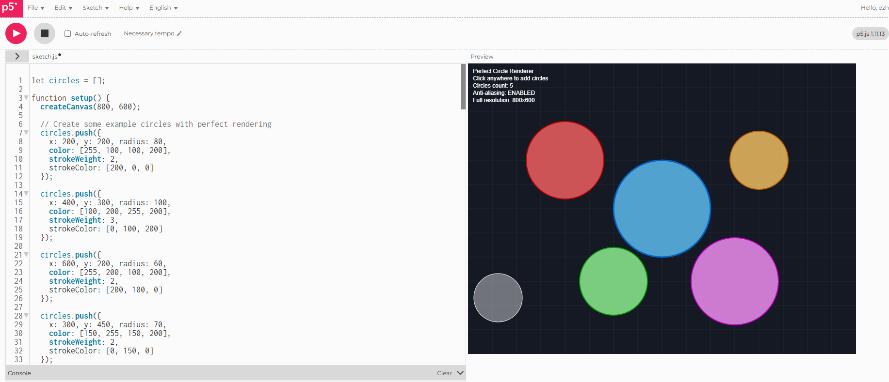
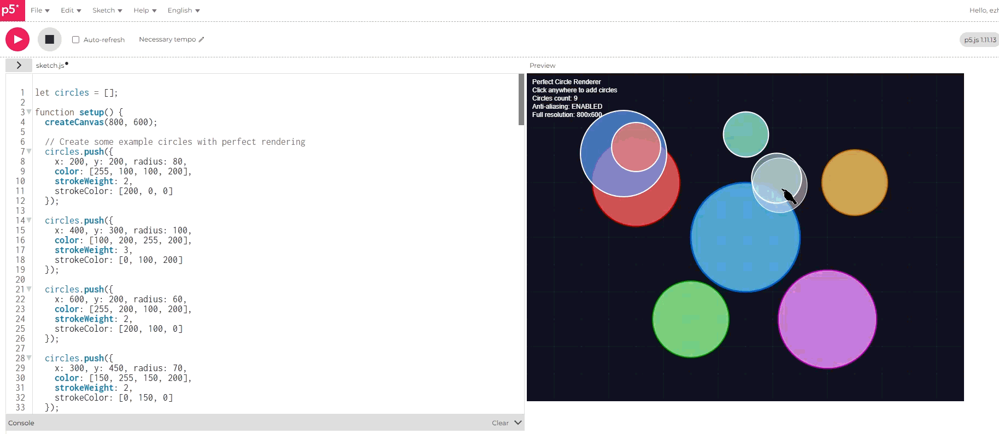
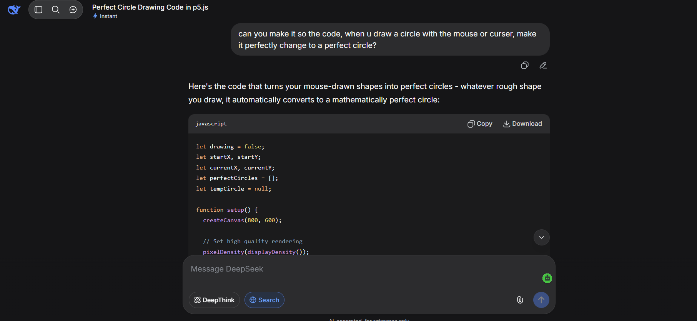
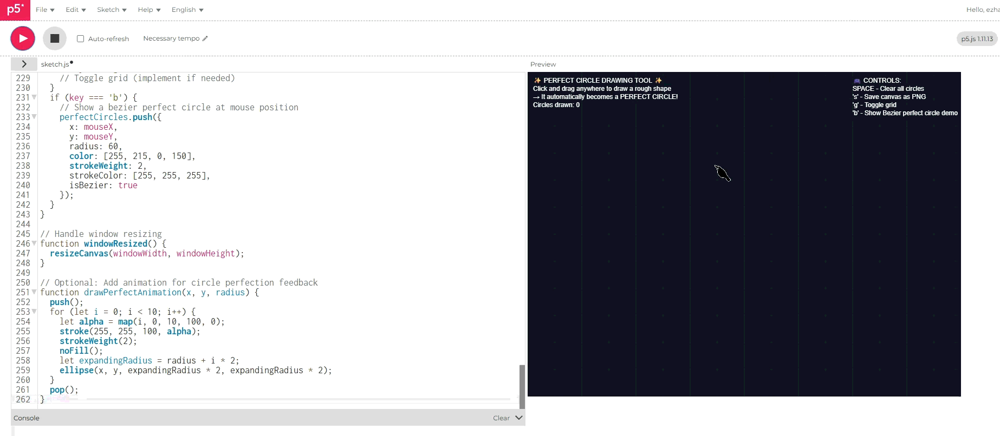
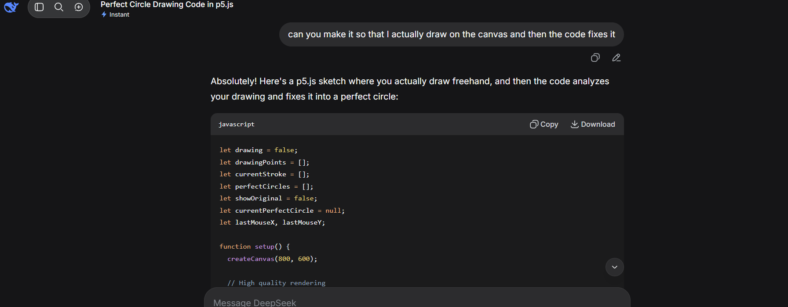
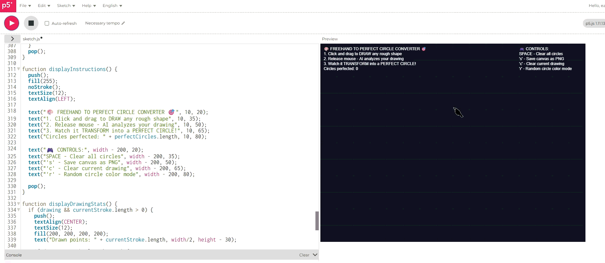

# Week 08

[← Back to Home](../index.md)

## Documentation 
**07/05/2026** 

## **Refining Reverse Brief and Design Framing**

Reverse brief is a document
that help define my framing
and scope of my direction. After looking through the stream brief I wanted to do (Emerging tech) which **invites students to critically speculate about emerging technologies and their possible socio-
cultural implications, exploring how our ways of connecting, collaborating, and creating might be transformed
in a plausible future Aotearoa.** 

I start answering questions just to clear my thoughts.

 ### **Which part of the brief I want to focus on?** 

Looking through the brief keywords, I wanted to look into the primary lens of "create." 

**"How might emerging technologies transform making practices, or understandings of
creativity, for practitioners and creative communities in Aotearoa?"**

Just looking back on my interests I wanted to do things with animation robotics and coding, so naturally something that comes to mind is either do an installation (so something physical) or work towards making a game (whether that's through VR or something else). But I want to have some level of interactivity in my project. 

So animation would provide the speculative media prototypes, using motion as communication. 

Coding would be interactive system, things like decision making or behaviour design. 

Robotics would present the physical part of the design. 

### **Which part of the brief feels most urgent, useful, or meaningful?**

From the brief the most urgent would definitely the mention of AI. For me, a meaningful angle would be to look at the future of creative labour and authorship in Aotearoa.

With how fast AI is developing, in the future who gets credit when an animator chooses to create with an AI? Will it displace or augment Maori and Pasifika creatives? And what happenes to hand drawn, imperfect animations when AI can just perfectly replicate motion? 

This is urgent because creative industries in NZ are already feeling AI pressure, but speculative design and offer things like provocative prototypes and open public debates before 

### **What specific issue, audience, or situation are you choosing to centre?** 

A specific issue I want to look at focuses on the favour of AI generated animations, people or businesses chooses to use AI to make short clips because it's much easier and cheaper compared to hiring someone to do the job. And the reason why we can tell it's AI generated because it has this almost "uncanny" smoothness to the visuals. 

The loss of imperfect, human centered animation.

2. What is it deliberately not addressing?
What is outside the scope of this project?
What related issues might be important, but are too broad for
this response?
What are you choosing not to solve?
Why?

### **What is it deliberately not addressing?**

Currently, my project isn't asking: 
- Why do businesses perfer cheaper AI animations? 

- How much money does AI save per project? 

- Should human animators receive government support?

### **Why is it excluded?**

It may have been because I have framed the core issue as the loss of something imperfect and human centered reasons behind that and not the business logic. And these are two very different problems considering the brief is asking me to examine the understanding of creativity and making practices, not commercial purchasing. 

Including this aspect would turn the project into more like a market analysis and not something that is speculative or something that is valuable creative work. 

### **What is outside the scope of this project?**

Something that is outside of my scope would be: 

- Building a fully functional polished game or installation? Because the goal is to have enough just to provoke with enough interactivity, not to actually release it.

- Proving that human animation is objectively better. The project isn't made to defend human imperfection but should question why it is being erased/ replaced. 

- Designing a tool that allows human animators to compete with AI. This also feels very business like, making a product instead of a speculative design.

### **What related issues might be important, but are too broad for this response?** 

- Educational part, if students grow up with AI, will they ever get the chance to learn how to animate instead of putting in a prompt?
- The Maori and Pasifika data? I feel like that should have a different set of data just because there are more issues that leads to the loss of their art. 

### **What am I choosing not to solve?**

I am choosing not to help human animators to compete with AI on speed, cost or the perfection. Instead I am choosing to present imperfection as meaningful, make what is lost when the uncanny smoothness of AI becomes defult and provoke the question: Why does easy= better? 

So I am not choosing to make a faster animation tool, not making AI feel more human (although its already working on that :eyeroll:) 

But I am creating an interactive installation or a game that makes an interactive installation or game that pushes viewers to experience the tension between their own imperfection and a system that tries to smooth it, leaving them to think, "Was my version genuinely that bad? So much so that it's rejected by the system?" 

## **What assumption is this based on?**

### **Why?**

Because if I solved the problem, by making a tool for the artists to compete with the AI, I would erase the lose part, and along with that the question. And by not solving it, focusing on the speculative design brief, I allow the viewer to sit and think about the issue. 

### **What are you taking for granted in this framing?**
Something I'm taking for granted in this framing is that imperfection also has value. I'm assuming that the uncanny smoothness in ai is undesirable and is worse than human made work, and the loss of the imperfect human work is a problem worth addressing. 

### **What are you assuming about the users, site, audience, or problem?**
- Assuming that the viewer can see the difference between human animation and AI animation. And if they can't tell the point of my project fails. 

- Assuming that the viewers cared about the creative labour and ownership of the work. (because many people prefer the final outcome with AI, and it's fast and cheap)

- Assuming that the viewer would engage with the annoying frustration or discomfort rather than just moving on. Taking into account that not everyone is willing to stay for something that frustrats them. 

**Assumption about the site** 

- To have a physical place/ room to present and set up in

- The viewer would interact one at a time or in small groups. 

- A place where it allows for reflection? and not just for a quick try out. A busy place might ruin that...

**Assumption about the problem itself**

- Assuming that the AI generated animations actually displace human animation and not used as a tool or a different option. 

- The uncanny smoothness is a recognisable aesthetic.

- The problem is not based on anything technical or economical. 

### **What has to be true for this approach to make sense?**

For my approach to make sense, 

- It must make sure that viewers can tell the difference between AI and human made work, and finds that difference meaningful. 

- That they are willing to engage with the activity that makes them feel something (whether if its frustration, dissapointment, etc)

- That the loss is a real and ongoing issue, and that the physical thing would have to be able to demostrate the point without a long explanation. 

- Focusing on the community, surrounding this to the context of being in Aotearoa. 

- My skills animation, coding or robotics can produce something that is just enough fidelity (not perfect--> purposly unfinished feel?)

### **Why?**

Because speculative design is not about proving facts or showing solution, it's about testing assumptions through artefacts. If trying to prove every assumption first we won't actually get anywhere. The point is so that we can provide reflection, spark debates and open up alternative ways of thinking. 

## **What value or priority guides this framing?** 

The primary value is that imperfection is evidence of being human, that the authenticity of the process over a polished outcome, that I am prioritising the trace of human made choices, the visability of effort and error and the right for creative work to be unfinished, unique without being corrected. 

### **What matters most in the way you are framing this project?**

What matters the most if the perservation of creativity, the ability to be imperfect without consequence or penalty. What matters is that the question remain open, something that is not solved or answered but felt. 

The process matter more than the product, how something was made of its meaning. Easy interaction would help with my arguement and the loss matters more than solution. 

### **Is your project mainly guided by accessibility, experience, sustainability, efficiency, inclusion, wellbeing, beauty, clarity, or something else?**

I guess my project isn't guided by most of these qualities, partially maybe the inclusion and the experiences. But rather guided by the honesty about the loss of human made artwork, visible parts of mistakes or something imperfect and the provocation over the solution. 

### **Why?** 

Since the brief asks for "Provoke reflection, invite debate, or open up alternative ways of thinking." If my project were guided by efficiency I would've pivoted to make a faster animation tool, something that would simplify the interactivity or something that would help polish the visuals. 

### **What criticism might this framing receive?** 

- Romanticising imperfection, people might say that the pure human craft never really existed, animators have always used tools to smooth and correct them. 

- Criticisim around this project being afraid of using new tools? (the whole thing about how ai is suppose to be used so we have easy work or whatever) 

### **What might someone disagree with in your approach?**

- That uncanny smoothness is a problem, smoothness is seen in anime, cartoons, smoothness is a skill

- Not everyone care about how something is made but only on if it's what they consider as good 

### **What might be misunderstood about your starting point?**

That I am against the whole AI thing, but I'm just questioning the aesthetic and cultral cost of using a certain part of AI. Another would be thinking that I am trying to "ban" or think that all AI animation is bad, I'm not, I'm only focusing on the uncanny smoothness and how some may prefer this over human made work, which can also be smooth, but it's just not fast or cheap enough. Some AI animation could be wonderful? But I fear this may be outside of my scope. 

### **If someone challenged your logic, where would they push back first?**

I guess just asking if the loss is real or if this is just an aspect I personally don't like. Or that the viewers actually like the AI animations better...

### **Why?** 

Well the project is suppose to provoke something, this could be in a form of debate, if my project didn't do that I think it would be considered as a fail? 

# **Planning and starting Experiment 3** 

In order to move on with my experiments, I would have to look back at my reverse brief and ask myself:

- What still needs to be tested?
- What matters most in this direction?
- What am I not trying to do

Reflecting back on my previous experiment, I did that based off the feedbacks I was given from the crit. Where I should consider making something for me (as part of experimenting) which I did. 

I also was offered the option to look/ pivot to a different social issue (it was e-waste and climate justice, but during crit I was suggested online saftey) Which I think is closer to what my stream brief is. 

After going back my reverse briefing, **what If I made a code that forces you to draw a perfect circle?** or a code that slowly pushes the imperfect circle into a perfect circle? 

## **Goals**
For this third experiment, I would like to: 

- Work/ complete this as fast as possible, considering how slow I did my last two experiments, how could I challenge myself to speed things up? 

I will give myself a 10 minute time frame to see how this would turn out.

- In regarding the experiment itself, if It does succeed, could the users feel the difference when the mouse/ cursor is being fixed? 

- I shouldn't expect this to work? I feel like for the last 2 experiments I have been changing and fixing them so they would be viable, what if I just let this one fail? 

## **How will I structure my experiment?** 

s p e e d r u n  it. (jk)

Ofcourse, I will be providing reasoning and images to backup my experiment. Along with the tools I will be using, 

- P5.js
- AI
- my mouse and keyboard if you really have to count.

## **Experiment 3- A code that perfects your circle drawings for you (without your permission)** 

To start this, I wanted to keep in mind that I am trying to complete this as soon as possible. So what could I do? 

vibe coding (gasp)

I chose this to prove a point (almost) In my reverse brief I mentioned how many prefered how quick and easy and simple and cheap this way is, so let's see how great this really is...

The AI I chose to use in this case is Deepseek. 

I gave it a simple line of command,

"can you give me s code that perfects your circle drawings for you in p5.js"

I then copied this into p5.js, and clicked run, 

Um. Well this isn't what I had in mind, I was more thinking allowing me to move my curser, attempt to draw a circle but the code would fix it even though I don't need it to be fixed? 

All this did was generate perfect circles...

I guess I should've been more specific about what I want but like...isn't that the AI's job. 

I also, could just conclude the experiment right here. This took me a maximum of 5 minutes, and it failed. But I feel like this didn't really do or mean anything, so I will refine it to better fit. 

I changed the promt, ”can you make it so the code, when u draw a circle with the mouse or curser, make it perfectly change to a perfect circle?“

...perfect circle alright 

Well! This is also a fail, because it just gave me the ability to draw perfect circles. There is no fixing in place, I didn't even get to draw the actual circle :(

So I tried again (if this doesn't work I'm stopping 🙄)

Again, I copied it into p5.js 

It worked? Kind of? 

It allowed me to draw onto it and it fixed it into a perfect circle afterwards. Although you do have to manually refresh the code but I would consider this not bad? 

I am surprised 

## **Conclusion?** 

Well, 10 minutes is up, (I also used this time to document) And honestly? I am surprised that the last attempt is somewhat close to what I want? I was more aiming for something that would change *while* I am drawing the circle. 

I really didn't expect this to work after the first attempt, however I do see the appeal of why people would rather use AI instead of looking up at references on how to build that code yourself and go through trial and error. Something I have noticed is the lack of "freedom" with using AI to vibe code, If I were to do this on my own I would've been able to express more, gone more in depth to make this work and actually learn something out of it. 

## **What will I focus/ do next week?**

Since the crit is coming up, I will be presenting my second and third experiment to my peers. Speaking on what I have learnt and why I have chose to do this, along with asking for feedback and reflect, think and plan for my fourth experiment. 

## **Reference**

AI Animations Are Emotionally Broken (Proof Inside). (2025). Wingmatestudio.com. https://www.wingmatestudio.com/blog-posts/emotion-in-motion-why-ai-animations-feel-different

‌