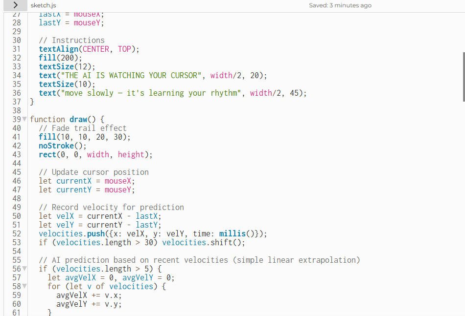
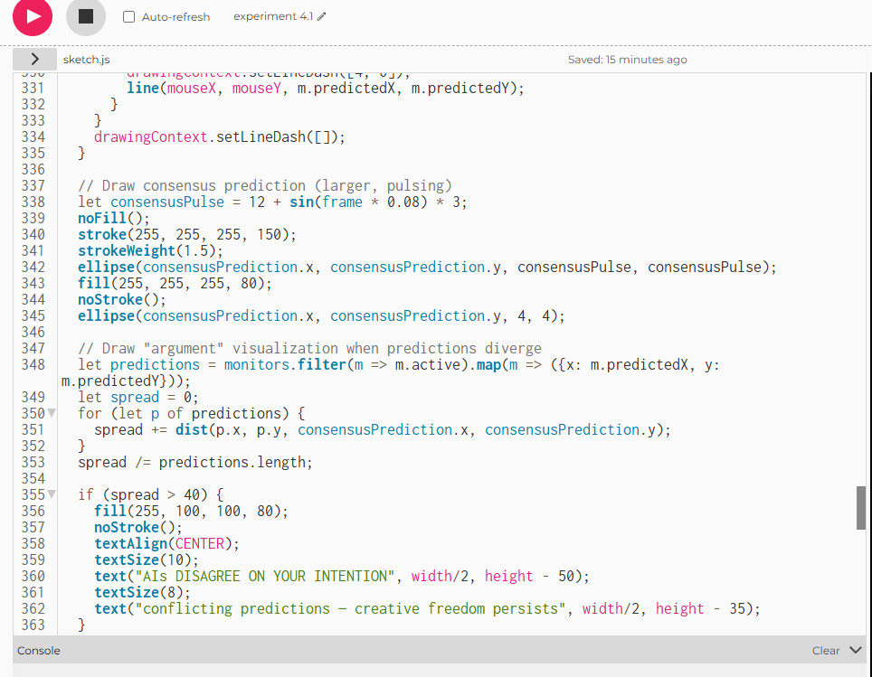

# Week 10

[← Back to Home](../index.md)

## Documentation 
**21/05/2026** 

# **Starting Experiment 3**

For this experiment, I would be using vibe coding to achieve a fast making experiment. 

I first put in the prompt first, "can you give me a experiment idea that looks like the AI is monitoring the curser? so like something is following the curser on the canvas in p5.js" 

The ai I will be using is deepseek.

It generated a code and I went ahead and popped it into p5.js, 

<iframe src="https://editor.p5js.org/ezha440/full/DnqGQ2EDe" width="400" height= "400"></iframe>

Which gives a tracker that follows your cursor whereever it is on the canvas. I am surprised that this worked first try? Usually it takes a bit for it to get to what I want. 

The sketch constantly tracks your mouse position and recent movement velocities to predict where you're going next. Typically, 15 pixels ahead along your current trajectory. A red circular "eye" (the AI) moves towards this predicted location, not your actual cursor, creating the unsettling sense that something is anticipating your choices. Your path leaves a blue fading trail (your creative history), while the AI leaves a red trail (its expectations). Over time, a confidence bar rises when your movements become consistent, and if confidence stays high, ghost suggestions appear. Soft visual nudges towards the AI's predicted path. The longer you move predictably, the more the AI "thinks it knows you".

This is great, but I think It could do with more sensors, having multiple follow the cursor. I asked the Ai to add more monitors to the original code. 

<iframe src="https://editor.p5js.org/ezha440/full/GZG27sPlF" width="400" height= "400"></iframe>

The sketch creates five independent AI agents, each stored as an object with its own position, prediction strategy, confidence level, and colour. In every frame, the code records the cursor's current position and velocity, then updates each AI's prediction differently based on its strategy: Velocity-AI predicts using recent speed, History-AI averages past positions, Pattern-AI detects repeating movements, Chaos-AI adds random noise, and Meta-AI averages all other AIs' predictions. Each then moves towards its predicted location (not the cursor itself), leaving a coloured trail behind. The dashed prediction lines connect your cursor to each AI's forecast. A white consensus prediction circle shows the confidence-weighted average of all AIs. 

I think this is pretty well done? It is only the second attempt. 

## **Reflection on my experiment- overall**

I fulfilled my goals, it was fast and quick, I didn't spend too long on it and I understood why and how the code worked. 

I do think the text that the code has provided saying that I have become predictable was kinda freaky but I think that was the point of making it speculative. 

## **Reflecting on my Research Journey** 

- Where did you begin? (e.g. a technology, social issue)

I started this journey by focusing on my interests, before linking them to a social issue. (Climate justice and specificlly e-waste). I wanted to test out things within my interests, so using coding and animation the most. 

-  What were some defining moments? (e.g. discoveries, pivots)

I would say when it was the first crit lesson, I had troubles coming up with viable experiments that had both connections with my interests and social issue. And my peers offered useful advice on how I should pivot and suggested that I could start at a point making something for myself, or something that I would deem useful. 

I realized that while designing, this is a perspective I rarely consider. And I have learned that it's helpful in times rather than dedicating to making something for someone else. 

-  When did you encounter challenges?

I struggled with time management. Alot of times I am staying up super late even though with planning I could completly avoided that. This would then lead me being drained and burnt out really fast. I had no motivation to do work and struggled with coming up with ideas. 

As for the technical side, I did find it challenging just because of my lack of skills. But I would like to see it as a learning curve. 

I would admit I struggled with blogging all of my processes down. There were certain times where I would think I am not reflecting enough or I'm just doing the reflection wrong? 

- What were your failures?

I had one experiment that didn't work, although I think that's purely because I had a certain set of goals for it hence why I wouldn't work on it anymore. But everything else I think went okay.
...not including how I said I was gonna better time management but end up not anyway. 

- What surprised you? What did you learn about yourself?

That I procrustinate alot? I found myself being lazier with wanting to do work, or that I am trying to cut corners alot and wanting to get things done as soon as possible. (I wasn't like this before I swear)

- What do you think is your strongest direction? What alternatives do you see?

After being handed the stream briefs I see myself having more of a goal to work towards. For the longest time I struggled because I didn't see an aim? Work/ project wise, I would like to continue researching into the impacts of AI on today's creative industry. (the CREATE part of the emerging tech stream brief) Alternativly, I could look into CONNECT brief, which I also found interesting. 

- Where might you be heading next

I would like to just focus on planning the presentation for week 12. And if things goes well then we will see...

## **Planning Week 12 Presentation** 
I start the planning with answering some of the questions that are provided to me. (This is a rough version)

**1. Connection to your DESIGN 300 Proposal
What specific local issue from your DESIGN 300 proposal does your work address?**

- How do your experiments map onto a part of that proposal?

Earlier during this course, since I didn't get the brief I would say most of my experiments aren't as connected to the proposal. 

"This challenge invites students to critically speculate about emerging technologies and their possible socio-
cultural implications, exploring how our ways of connecting, collaborating, and creating might be transformed
in a plausible future Aotearoa." 

It was only when I was handed the brief I pivoted. My experiments then would be more speculative and use more tech stuff rather than hand drawings. 

- What different design opportunities does your DESIGN 300 proposal reveal, and how have your DESIGN 303 experiments helped you recognise them?

While in the 300 course I struggled for a long time to come up with a clear direction. If anything I think it's 303 that has helped me better define opportunities. 

My proposal for 300 mainly focuses on the "loss" of human imperfections within the creative industry here in New Zealand. How Ai has taken over and that instead of hiring actual animators businesses would now choose to AI generate in order to cut cost. 

Some different design opportunities I could explore better outside of CREATE would be CONNECT. I keep my scope as local as possible so it would help me in the long run, whether that's with user testing or researching.

- Where did a gap, mismatch, or pivot emerge between what you planned and what actually happened?

I didn't plan to pivot into doing issues on AI, or anything technical untill the briefs were out. (I was initially going to do place making, but the emerging tech brief was just much more appealing.)

- Why did that gap or pivot happen?

I guess the pivot also came from a place where I would like to learn something new by the end of my project or to better define a skill that I already have. 

- How did the pivot reshape your understanding of the issue, the brief, or your possible Capstone directions?

After locking into the emerging tech brief and researching, I found the current state of the world alarming, especially on the creative industries. But this way, it helped me regain the will of wanting to make something (in this case speculative) to help raise awareness, or just a personal take on this issue. 

**2. Skill Development & Application
What specific skills, tools, or techniques did you engage with through prototyping?** 

- How did you record feedback?

I recorded my feedbacks mainly with hand written notes, screenshots, and through peer reviews.

- How has your work changed from your earliest prototype to your latest? When did you have to change your direction, why?

From my earliest prototype. I was doing the experimenting from a place of just wanting to better my skill. But in the latest experiment I had a purpose/ a specific requirement I wanted to test out or visualize. 

Again, I changed because of my choice in the capstone brief. 

- What failed, broke, or had to be abandoned along the way?

I keep wanting to include all three of my interests into my experiments, that I had to work around them and that has shut off some options for me while coming up with experiments. But I realized near the end that I shouldn't do that to restrict myself. 

- What did that failure teach you?

Just because I like something doesn't mean I have to have it. And would even argue that this sacrifice is much needed. 

- Which specific skill do you now need to develop, and why?

Since I'm planning to work more on tech stuff, I would like to better in java scripting and potentially looking into actually building something physical. 

**3. Lessons Learned & Future Plans**

- What key takeaways have emerged from your experiments and research?

Things like better understanding the topic I want to look into. Through experiments I have learnt skills that would help me in capstone. Especially when I have never done any scripting before this. 

- Which aspect of your experiments now feels like your strongest Capstone direction, and what would you refine or explore further?

It's most likely the last two I have done, experiment 3 and 4. Because that's when I started relating it. I would like to refine them through embedding code into something physical, which then allows me to work on robotics. 

- What are at least two other possible directions you could present in Week 1 of DESIGN 304, and how are they different from your strongest direction? Where do you see this work in the near (i.e in a month?) or distant future (i.e mid of capstone)?

Two other possible directions would consider the other two focus areas in the brief, one is CONNECT and the other is COLLABORATE. 

They are different because I aim to make an installation as a final for my strongest direction, I see myself making a speculative product for the other two. 

Regarding where I see this work in the near future, I would think a finished or able string of code that would work on something robotic, along with a detailed speculative framing. 

- How has your positionality shaped specific decisions in this work?
In what ways will you operate differently as a designer and a researcher?

As a designer and researcher, I will operate differently in two ways, from a designer point of view, I aim to use color, movement and sound to make the AI monitoring part as uncomfterble as possible. As a researcher I would focus on how the viewers would respond, how they do in the process and what after. 

- What would you do differently next time, and what does this suggest you should test, build, or clarify before DESIGN 304 begins?

I guess to just better plan overall, whether this is my time, aims to develop my skills and clearify my research before 304 starts. 
